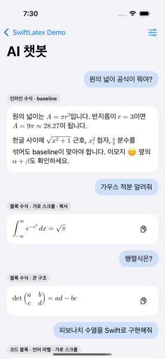
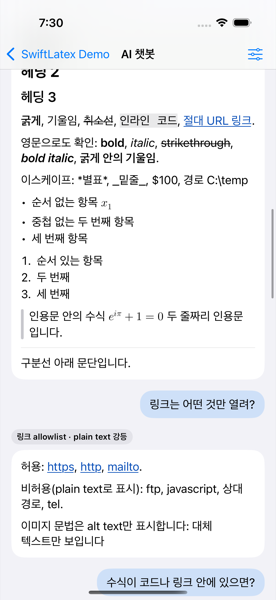
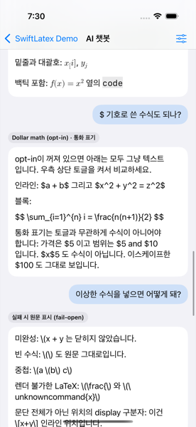
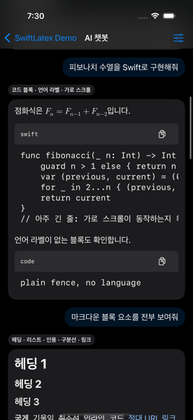

# SwiftLatex

[](https://swift.org)
[](https://developer.apple.com/ios/)
[](LICENSE)
[](CHANGELOG.md)

> **베타 (0.1.1)** — 공개 표면은 작지만 아직 `1.0`이 아니다. minor 버전에서 API가
> 바뀔 수 있다. 변경 내역은 [CHANGELOG.md](CHANGELOG.md)를 본다.

LLM 채팅 메시지를 네이티브로 렌더하는 Swift Package. Markdown, 인라인/블록
LaTeX 수식, 코드 블록을 하나의 뷰로 표시한다. SwiftUI는 `LatexMarkdownView`,
UIKit은 네이티브 `LatexMarkdownUIView`를 쓴다 — 두 뷰는 같은 파서·수식 raster·
generation 관리를 공유한다.

```
원의 넓이는 \( A = \pi r^2 \)입니다.
            ↓
문장 흐름 안에 baseline 정렬된 수식이 포함된 네이티브 텍스트
```

- WebView·HTML 실행 없음. 전부 `Text`, `Image`, `ScrollView`로 렌더한다.
- 스트리밍 입력(최신 전체 `String`)을 전제로 설계했다. coalescing + latest-wins.
- 시스템 텍스트 선택, Dynamic Type, VoiceOver, light/dark를 그대로 따른다.

설계 문서: [DEVELOPMENT.md](DEVELOPMENT.md)

---

## 스크린샷

`Examples/SwiftLatexDemo`의 챗봇 화면. iPhone 16 Pro / iOS 18.6 실제 렌더다.

| 인라인·블록 수식 | Markdown 요소 |
|---|---|
|  |  |
| 문장 흐름 안에 baseline 정렬된 `\( A = \pi r^2 \)`, 가로 스크롤과 복사 버튼이 붙은 블록 수식(적분·행렬) | 헤딩, 굵게·기울임·취소선, 인라인 코드, 링크, 리스트, 인용, 구분선. `\*별표\*` 같은 escape 해제도 함께 |

| 달러 수식 opt-in · fail-open | 코드 블록 (dark) |
|---|---|
|  |  |
| `$` opt-in이 꺼지면 전부 텍스트. `$5`, `$5 and $10`은 켜도 수식이 아니다. 잘못된 LaTeX는 구분자를 포함한 원문 그대로 | 언어 라벨과 복사 버튼, 긴 줄 가로 스크롤. 색은 light/dark를 따라간다 |

---

## 설치

`Package.swift`:

```swift
dependencies: [
    // 0.x 베타다. minor 버전에서 공개 API가 바뀔 수 있으므로 minor로 고정한다.
    .package(url: "https://github.com/Jimmy-Jung/SwiftLatex.git", .upToNextMinor(from: "0.1.1")),
],
targets: [
    .target(name: "MyApp", dependencies: ["SwiftLatex"]),
]
```

Xcode에서는 File → Add Package Dependencies에 저장소 URL을 넣는다.

전이 의존성은 [swift-markdown](https://github.com/swiftlang/swift-markdown)(파싱)과
[SwiftMath](https://github.com/mgriebling/SwiftMath)(수식 raster) 둘이다.

---

## 사용법

### SwiftUI

```swift
import SwiftLatex

struct MessageView: View {
    let markdown: String

    var body: some View {
        LatexMarkdownView(markdown: markdown)
    }
}
```

공개 표면은 이것뿐이다.

| API | 설명 |
|---|---|
| `LatexMarkdownView(markdown:parsesDollarMath:)` | 렌더 뷰. `parsesDollarMath` 기본값 `false` |
| `.latexTheme(_:)` | 색·폰트를 바꾸는 View modifier |
| `LatexTheme` | 요소별 색 6종 + 폰트 7종 + 수식 서체 |
| `LatexFont` | 폰트 지정값 (서체·Dynamic Type 기준·크기·굵기) |
| `LatexTextStyle` / `LatexFontWeight` | Dynamic Type 기준 스타일, 굵기 |
| `LatexMathFont` | 수식 서체 12종 |
| `Color.accessibleLink` | 대비 기준을 넘는 기본 링크 색 |

메시지 전체의 세로 스크롤과 목록 virtualization은 소비 앱 책임이다. 뷰는 자기
콘텐츠 높이만 갖는다.

```swift
ScrollView {
    LazyVStack(alignment: .leading, spacing: 16) {
        ForEach(messages) { message in
            LatexMarkdownView(markdown: message.text)
                .padding(14)
                .frame(maxWidth: .infinity, alignment: .leading)
                .background(Color(.secondarySystemGroupedBackground))
                .clipShape(RoundedRectangle(cornerRadius: 18))
        }
    }
    .padding()
}
```

### 스트리밍

증분 parser는 제공하지 않는다. 호출자는 **누적된 전체 문자열**을 계속 넘긴다.
같은 뷰에 새 값이 들어오면 이전 작업을 stale로 표시하고 최신 값만 렌더한다.

```swift
@State private var answer = ""

var body: some View {
    LatexMarkdownView(markdown: answer)
        .task {
            for try await chunk in client.stream(prompt) {
                answer += chunk          // 누적 문자열을 그대로 다시 넘긴다
            }
        }
}
```

토큰 이벤트는 **최대 약 10Hz로 합쳐서** 전달한다. 그보다 잦게 갱신해도 내부
coalescing이 흡수하지만(실행 1 + 대기 1), 불필요한 파싱을 줄이는 쪽이 낫다.

측정값(Debug, iPhone 16 Pro / iOS 18.6 simulator): 50 KiB 입력 parse p50 119ms,
p95 129–230ms. 10Hz로 30초 갱신 후 마지막 입력에서 idle까지 25–28ms.

### 테마

색과 폰트 모두 **요소 단위**다. 범위(문자 구간) 단위 지정은 없다.

```swift
LatexMarkdownView(markdown: message)
    .latexTheme(
        LatexTheme(
            textColor: .primary,
            linkColor: .accessibleLink,
            codeBlockBackground: Color(.secondarySystemBackground),
            inlineCodeBackground: Color(.secondarySystemFill),
            quoteBar: Color(.systemGray3),
            codeHeaderBackground: Color(.tertiarySystemBackground),
            bodyFont: LatexFont(relativeTo: .body),
            heading1Font: LatexFont(relativeTo: .title1, weight: .bold),
            heading2Font: LatexFont(relativeTo: .title2, weight: .bold),
            heading3Font: LatexFont(relativeTo: .title3, weight: .semibold),
            heading4Font: LatexFont(relativeTo: .headline),
            codeFont: LatexFont(design: .monospaced, relativeTo: .body),
            codeLabelFont: LatexFont(design: .monospaced, relativeTo: .caption),
            mathFont: .latinModern
        )
    )
```

어느 폰트가 어디에 닿는지:

| 필드 | 적용 대상 |
|---|---|
| `bodyFont` | 본문 문단, 리스트 마커, 링크, 인라인 수식 fallback, 원문 fallback. **수식 raster 기준 크기** |
| `heading1~4Font` | 헤딩. 4단계 이하는 전부 `heading4Font` |
| `codeFont` | 인라인 코드, 코드 블록 본문, 블록 수식 fallback |
| `codeLabelFont` | 코드 블록 헤더의 언어 라벨 |
| `mathFont` | 수식 서체 (raster cache key에 포함) |

`LatexFont`는 `Font`/`UIFont`가 아니라 `Sendable` 값이다. 두 타입 사이에 손실 없는
변환이 없고 `UIFont`가 `Sendable`이 아니라서 중간 표현을 둔다. 두 렌더러가 같은 값에서
각자 폰트를 만든다.

```swift
// 커스텀 서체. 앱이 등록한 이름을 쓴다. 못 찾으면 시스템 서체로 물러난다.
LatexFont(design: .custom(name: "Georgia"), relativeTo: .body)

// 크기 고정 + 굵기. size가 nil이면 relativeTo의 기본 크기를 쓴다.
LatexFont(relativeTo: .title1, size: 34, weight: .heavy)
```

`size`를 줘도 Dynamic Type 스케일은 `relativeTo` 기준으로 계속 적용된다.
수식 크기는 `bodyFont` 크기를 따라가지만 배율 기준은 항상 `.body`다.

기본 `linkColor`는 시스템 블루가 아니다. `#007AFF`는 흰 배경에서 약 3.6:1로 본문
텍스트 대비 기준(4.5:1)에 미달해 접근성 audit에 걸린다. `Color.accessibleLink`는
light 약 7.5:1 / dark 약 8.9:1이며 밑줄도 함께 그린다.

### 달러 수식 (opt-in)

```swift
LatexMarkdownView(markdown: message, parsesDollarMath: true)
```

기본값이 `false`인 이유는 통화 표기(`$5`)와 충돌하기 때문이다. 켜도 아래 규칙으로
통화를 걸러낸다 — [수식 문법](#수식-문법) 참고.

### UIKit

`LatexMarkdownUIView`는 SwiftUI 호스팅 래퍼가 아니다. `UIView` 하위 클래스로
블록을 `UIStackView`에, 인라인 수식을 `NSTextAttachment`로 직접 배치한다.

```swift
let view = LatexMarkdownUIView(markdown: message, parsesDollarMath: false)
view.theme = .default
```

셀에서 쓸 때는 수식 이미지 hydration이 최초 레이아웃 뒤에 오므로,
`onContentSizeChange`로 self-sizing 재측정을 요청한다.

```swift
let registration = UICollectionView.CellRegistration<UICollectionViewCell, String> { cell, _, message in
    let view = LatexMarkdownUIView(markdown: message)
    view.onContentSizeChange = { [weak cell] in cell?.invalidateIntrinsicContentSize() }
    cell.contentView.addSubview(view)
    // view를 contentView 4변에 pin
}
```

Dynamic Type·다크 모드·display scale 변경은 뷰가 trait 변화로 직접 감지해
다시 렌더한다. 소비 앱이 할 일은 없다.

SwiftUI 뷰를 호스팅해서 쓰는 경로도 그대로 유지된다.

셀:

```swift
let registration = UICollectionView.CellRegistration<UICollectionViewListCell, String> { cell, _, message in
    cell.contentConfiguration = UIHostingConfiguration {
        LatexMarkdownView(markdown: message)
    }
}
```

`UIHostingConfiguration` 셀은 자체 크기 조정을 지원한다. layout이 고정 `itemSize`면
잘리므로 estimated dimension(또는 list layout)을 쓴다.

일반 화면:

```swift
let host = UIHostingController(rootView: LatexMarkdownView(markdown: message))
addChild(host)
view.addSubview(host.view)
host.view.translatesAutoresizingMaskIntoConstraints = false
NSLayoutConstraint.activate([
    host.view.topAnchor.constraint(equalTo: view.topAnchor),
    host.view.leadingAnchor.constraint(equalTo: view.leadingAnchor),
    host.view.trailingAnchor.constraint(equalTo: view.trailingAnchor),
    host.view.bottomAnchor.constraint(equalTo: view.bottomAnchor),
])
host.didMove(toParent: self)
```

### 데모 앱

```bash
cd Examples/SwiftLatexDemo && xcodegen generate && open SwiftLatexDemo.xcodeproj
```

LLM 챗봇 화면을 스크롤하며 렌더 케이스를 한 번에 확인한다 — 인라인/블록 수식,
코드 블록, 리스트·인용, 링크 allowlist, 금지 문맥 보호, 실패 시 원문 표시,
다국어·RTL, 미지원 노드 강등, 긴 답변. 우측 상단 메뉴에서 `$` 수식 opt-in을
토글해 비교한다. UIKit `UIHostingConfiguration` 화면도 함께 들어 있다.

---

## 구동 원리

### 문제

`swift-markdown`에는 수식 AST 노드가 없다. 그래서 Markdown을 먼저 파싱하면
`\(a * b\)`의 `*`가 강조로, `\(x_[i]\)`의 `_`와 `[`가 다른 노드로 쪼개진다.
반대로 수식을 먼저 찾으면 코드 블록이나 링크 안의 구분자를 수식으로 오인한다.

### 2-pass 파이프라인

```
원문 UTF-8
   │
   ├─ 사전 byte 상한 검사
   │
   ├─ 1차 파싱  ── 수식을 찾지 않는다. 금지 문맥과 paragraph 범위만 수집
   │     ├─ hard barrier: CodeBlock, InlineCode, HTMLBlock, InlineHTML
   │     ├─ soft range:   Link, Image
   │     └─ paragraph 전체 범위 (block 수식 판정용)
   │
   ├─ 원문 전체 수식 스캔 ── Markdown 노드 분할과 무관
   │
   ├─ byte 길이를 보존하는 mask ── 수식 구간의 non-newline byte → ASCII 'x'
   │
   ├─ 2차 파싱  ── 마스킹된 버퍼. 수식 안의 Markdown 기호가 사라진 상태
   │
   └─ ParsedDocument ── 수식 자리를 원문 slice로 되돌려 채운다
```

핵심은 **mask가 UTF-8 byte 길이를 바꾸지 않는다**는 점이다. 그래서 2차 AST가 준
source range를 offset 변환 없이 원문에 그대로 쓸 수 있다. `restore(protect(s)) == s`를
byte 단위로 보장하고, property/fuzz 테스트로 고정한다.

### 금지 문맥: hard vs soft

- **hard barrier**(코드·HTML): 내부 구분자를 절대 수식으로 보지 않고, 경계를
  가로지르는 매칭도 만들지 않는다.
- **soft range**(링크·이미지): 수식 span이 그 범위를 완전히 감싸면 수식이 이기고,
  구분자가 범위 안에 있으면 수식이 아니다.

그래서 `[\(x\)](url)`은 링크로 보호되고, `\([a](b)\)`는 수식으로 렌더된다.

### 2단계 비동기 게시

`body`나 `.task`의 MainActor 구간에서 파싱·raster를 실행하지 않는다.
`.task`가 `async`라는 사실만으로 background 실행을 가정하지 않는다.

```
새 markdown 값
   │
   ├─ MainActor: generation 증가, 최신 원문을 fallback으로 즉시 표시
   ├─ 단일 worker: 실행 중 1개 + 최신 대기 1개만 유지 (latest-wins)
   ├─ off-main:  파싱
   ├─ MainActor: generation 일치 → 수식이 원문인 상태로 1차 게시
   ├─ actor:     수식 raster (cache 조회 → SwiftMath)
   └─ MainActor: generation 일치 → 이미지가 채워진 최종 게시
```

generation은 service 진입 직후, 파싱 직후, 각 수식 사이, 최종 게시 직전에 확인한다.
stale이 된 연산 결과는 UI에도 cache에도 넣지 않는다.

### 수식 raster와 cache

인라인 수식은 SwiftMath의 `MathImage.asImage()`가 준 이미지와 `LayoutInfo`를 쓴다.

```swift
Text(Image(uiImage: image))
    .baselineOffset(-layout.descent)
```

cache key는 LaTeX source, math font 식별자, 실제 point size, resolved RGBA,
inline/display mode, display scale이다. cost는 이미지 pixel byte(현재 상한
256개 / 64 MiB)이고 memory warning에서 비운다.

### 입력 보호

| 항목 | 값 | 동작 |
|---|---|---|
| 원문 UTF-8 byte | 256 KiB | 첫 파싱 전에 검사 |
| 초과 시 표시 | 64 KiB | `Character` 경계로 자르고 `… [입력 제한 초과]` 추가 |
| 수식 source byte | 4 KiB | `asImage()` 호출 전에 거부 |

수치는 내부 구현이며 공개 설정으로 노출하지 않는다.

---

## 렌더 계약

### Markdown

| 지원 | 내용 |
|---|---|
| 블록 | 문단, 헤딩, 순서/비순서 리스트, 인용, 구분선, 코드 블록 |
| 인라인 | 굵게, 기울임, 취소선, 코드, 절대 URL 링크, 줄바꿈 |
| 코드 블록 | 언어 라벨, 가로 스크롤, 복사 버튼, plain monospace |

### 수식 문법

기본:

- `\( ... \)` — 인라인. 한 logical line 안에서만 닫힌다.
- `\[ ... \]` — block. 공백을 제외한 **paragraph 전체**가 감싸진 경우만.

`parsesDollarMath: true`일 때 추가:

- `$ ... $` — 인라인, `$$ ... $$` — block(paragraph 전체)
- `\$`는 구분자가 아니다
- 여는 `$` 바로 뒤, 닫는 `$` 바로 앞에 공백이 올 수 없다
- 닫는 `$` 바로 뒤에 숫자가 올 수 없다 (`$x$5` → 텍스트)
- 인라인 `$...$`는 줄바꿈을 넘지 않는다
- `$$`를 `$`보다 먼저 판정한다

이 규칙으로 `$5`, `$5 and $10`은 수식이 되지 않는다. Pandoc과 동일하다고 주장하지
않는다. 구현한 규칙과 fixture가 계약이다.

### 실패 시 표시 (fail-open)

- 잘못되거나 미완성인 LaTeX → 원래 구분자를 포함한 **원문**을 표시
- 중첩 구분자 → 구간 전체를 원문으로 유지
- 미지원 Markdown 노드(표 등) → 읽을 수 있는 plain text로 낮춤. 조용히 삭제하지 않음
- 이미지 문법 → alt text만 표시
- HTML → 실행하지 않고 문자 그대로 표시
- 상한 초과 입력 → bounded prefix + 생략 marker

### 링크

자동 링크로 만드는 scheme은 `https`, `http`, `mailto`뿐이다. 상대 URL과 다른
scheme(`ftp:`, `javascript:`, `tel:` 등)은 plain text로 표시한다. 허용된 링크는
native `OpenURLAction`을 거치므로 소비 앱의 `environment(\.openURL)` override를
존중한다.

### 접근성

- 수식은 `"수식: <원본 LaTeX>"`로 읽는다. 링크가 있는 문단은 개별 link semantics를
  없애지 않도록 문단 label을 덮어쓰지 않는다.
- 복사 버튼은 native `Button` + 44×44pt hit target.
- Dynamic Type 각 단계에서 수식을 scaled point size로 다시 raster한다.

---

## 알려진 제약

- **한글은 시스템 폰트에 italic 변형이 없어 `*기울임*`이 시각적으로 적용되지 않는다**
  (iOS 제약). 영문·숫자에는 적용된다. 파서는 두 경우 모두 italic 플래그를 싣는다.
- 표, 원격 이미지, Mermaid, 신택스 하이라이팅, 편집, macOS UI는 v1 비목표다.
- 여러 블록을 가로지르는 연속 범위 선택은 지원하지 않는다(블록 단위 시스템 선택).
- 링크·이미지 Markdown 문법 **내부**의 LaTeX는 해석하지 않는다.
- 공개 parser/AST는 없다. `SwiftLatexCore`는 내부 target이다.
- UIKit 렌더러는 리스트 마커를 baseline이 아니라 top 정렬한다(중첩 스택의
  baseline이 불안정하다). SwiftUI 렌더러는 first text baseline 정렬이다.
- **범위(문자 구간) 단위 색·폰트 지정은 없다.** 테마는 요소 단위다. 굵게·기울임·
  취소선은 Markdown 원문이 정하고 소비 앱 API로는 지정할 수 없다.
- 인라인 코드는 감싼 블록 크기를 따르지 않고 `codeFont` 크기를 쓴다.
  헤딩 안의 인라인 코드도 `codeFont` 크기다.
- `.custom` 서체에서는 `weight` 지정이 무시될 수 있다(서체가 해당 굵기를 갖고 있어야 한다).

---

## 지원 matrix

| 항목 | 값 |
|---|---|
| 배포 대상 | iOS/iPadOS 16+ (선언). 실행 검증된 최소 runtime은 iOS 18.6 simulator |
| 검증 toolchain | Xcode 26.6 (17F113), Swift 6.3.3 |
| Swift tools | 6.0 (Swift Testing 사용) |
| 의존성 | swift-markdown `exact: 0.4.0`, SwiftMath `exact: 1.7.3` |

SwiftMath `1.7.2`는 `MTMathListBuilder`의 scope 버그로 Xcode 26.6에서 컴파일되지
않는다. `1.7.3`이 수정 버전이며 `MathImage.asImage()` API는 동일하다.

iOS 16 실행 검증은 호환 Xcode/runtime 또는 실기기 환경에서 별도 수행한다.

---

## 테스트와 CI

P0에서 실제 실행으로 고정한 명령 (CI simulator: iPhone 16 Pro, iOS 18.6):

```bash
# Foundation-only Core를 host에서 우선 검증
swift build --target SwiftLatexCore

# 전체 unit test (package scheme 이름은 `SwiftLatex`)
xcodebuild test \
  -scheme SwiftLatex \
  -destination 'platform=iOS Simulator,name=iPhone 16 Pro,OS=18.6' \
  -enableCodeCoverage YES

# UIKit lifecycle/UI test
xcodebuild test \
  -project Examples/SwiftLatexDemo/SwiftLatexDemo.xcodeproj \
  -scheme SwiftLatexDemo \
  -testPlan SwiftLatexDemo \
  -destination 'platform=iOS Simulator,name=iPhone 16 Pro,OS=18.6'
```

전체 파이프라인 + Core line coverage 80% gate:

```bash
scripts/ci-test.sh
```

스트리밍 30초 전체 측정 (기본은 CI용 5초):

```bash
TEST_RUNNER_SWIFTLATEX_STREAM_SECONDS=30 xcodebuild test \
  -scheme SwiftLatex \
  -destination 'platform=iOS Simulator,name=iPhone 16 Pro,OS=18.6' \
  -only-testing:SwiftLatexTests/StreamingBaselineTests
```

원칙:

- Swift 6 language mode와 complete concurrency는 tools 6.0 manifest가 우리 target에
  적용한다. 전역 `SWIFT_VERSION=6` override는 의존성까지 재컴파일하므로 쓰지 않는다.
- macOS host의 일반 `swift test`를 UIKit target 검증 근거로 쓰지 않는다.
- Core line coverage 80% 미만이면 `scripts/check-core-coverage.sh`가 nonzero로 종료한다.

---

## 기여

버그 리포트와 PR을 환영한다. 다음을 지켜 주면 리뷰가 빠르다.

- `scripts/ci-test.sh`가 통과해야 한다(Core coverage 80% gate 포함).
- 파서 동작을 바꾸면 `Tests/SwiftLatexCoreTests`에 fixture를 추가한다. 이 저장소에서는
  구현한 규칙과 fixture가 계약이다.
- 렌더 동작을 바꾸면 `Examples/SwiftLatexDemo` 챗봇 화면에서 눈으로 확인한다.
  실제로 이 방법으로 기울임·취소선 유실과 Markdown escape 버그를 찾았다.
- 새 기능 제안은 [DEVELOPMENT.md](DEVELOPMENT.md)의 비목표 목록을 먼저 확인한다.

## License

[MIT](LICENSE) © JunyoungJung

## Dependency licenses

- [swift-markdown](https://github.com/swiftlang/swift-markdown) — Apache License 2.0
- [swift-cmark](https://github.com/apple/swift-cmark) — 2-Clause BSD (cmark 파생)
- [SwiftMath](https://github.com/mgriebling/SwiftMath) — MIT License
